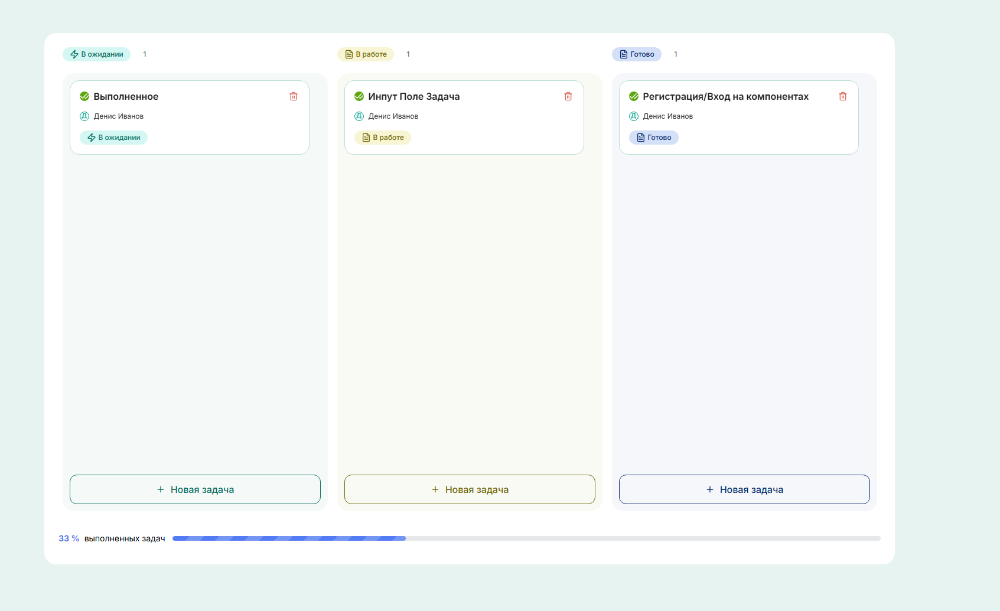

# Kanban Board

https://kanban-desk-pavel-kulakov.vercel.app/

Современное приложение для управления задачами с использованием методологии Kanban. Приложение позволяет создавать, редактировать, удалять и перемещать задачи между колонками с разными статусами.



## Функциональность

- **Управление задачами (CRUD операции):**

  - Создание новых задач
  - Редактирование существующих задач
  - Удаление задач
  - Перемещение задач между колонками (drag-and-drop)

- **Валидация формы:**

  - Проверка обязательных полей
  - Ограничение длины заголовка
  - Подсчет символов

- **Работа с данными:**
  - Хранение состояния в Redux
  - Загрузка данных из JSON файла

## Технологии

- **React** (функциональные компоненты)
- **TypeScript**
- **Redux Toolkit**
- **Styled Components**
- **react-hook-form**
- **Vite**
- **Lucide React** (иконки)

## Инструкция по запуску

### Требования

- Node.js (версия 16.x или выше)
- npm (версия 8.x или выше)

### Установка

1. Клонируйте репозиторий:

```bash
git clone https://github.com/pavelkulak/KanbanDesk.git
cd KanbanDesk
```

2. Установите зависимости:

```bash
npm install
```

3. Запустите проект в режиме разработки:

```bash
npm run dev
```

4. Откройте браузер и перейдите по адресу:

```
http://localhost:5173/
```

### Сборка проекта

Для создания production-сборки:

```bash
npm run build
```

Результат сборки будет находиться в директории `dist/`.

### Настройка ESLint и Prettier

В проекте используются ESLint и Prettier для обеспечения качества кода.

- Запуск проверки линтером:

```bash
npm run lint
```

## Структура проекта

```
src/
├── app/               # Конфигурация приложения
│   └── providers/     # Провайдеры (Redux)
├── entities/          # Бизнес-сущности
│   └── Task/          # Компоненты задач (TaskCard)
├── features/          # Функциональные модули
│   └── TaskBoard/     # Модуль работы с задачами (формы)
├── shared/            # Общие компоненты и утилиты
│   ├── api/           # API и работа с данными
│   ├── assets/        # Статические ресурсы (иконки)
│   ├── lib/           # Библиотеки и утилиты
│   ├── types/         # TypeScript типы
│   └── ui/            # UI компоненты
└── widgets/           # Композиционные компоненты
    └── KanbanBoard/   # Канбан-доска
```

## Автор

Pavel Kulak

